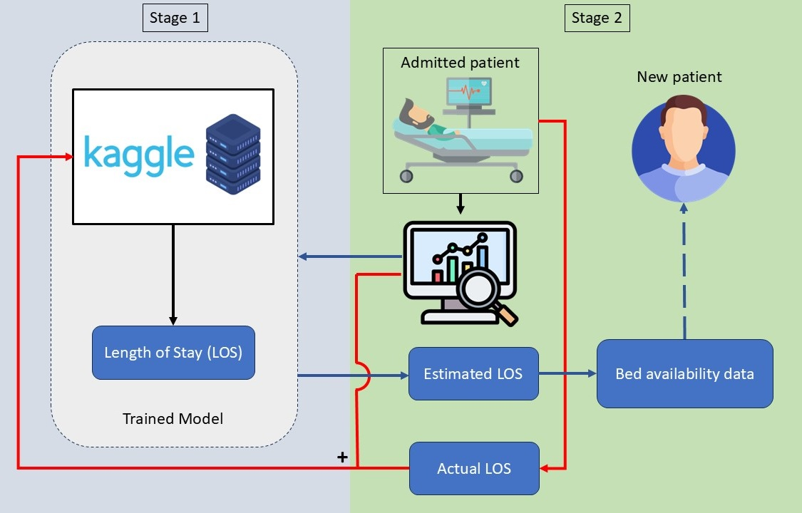

# Hackathon_indicon
[](https://opensource.org/licenses/Apache-2.0)

### Project Title: "Smart Bed Management: Predicting Hospital Bed Availability for Efficient Healthcare Delivery"

This project addresses bed shortages in government hospitals by developing a dual-stage AI-driven solution to predict patient length of stay (LOS) and bed availability.

---

## **Smart Bed Management**  
**Predicting Hospital Bed Availability for Efficient Healthcare Delivery**

---

### **Overview**
Efficient management of hospital beds is critical for healthcare delivery, especially during peak demands. This project aims to predict hospital bed availability using machine learning models, providing insights for better resource allocation and reducing patient wait times.

The overall flow of our method is shown in the figure below.

---

### **Getting Started**

#### Clone the Repository
```bash
git clone https://github.com/this-is-kb/Hackathon_indicon.git
cd Hackathon_indicon
```

#### Install Dependencies
Install the required Python libraries using the `requirements.txt` file:
```bash
pip install -r requirements.txt
```

#### Run the Python Script
Execute the modular script for data processing, model training, and evaluation:
```bash
python main.py
```

#### Explore the Jupyter Notebook
Open the notebook file for an interactive view:
```bash
jupyter notebook smart_bed_management.ipynb
```

---

### **Key Metrics**

| **Metric**          | **What It Measures**                                   | **Ideal Value** |
|----------------------|-------------------------------------------------------|------------------|
| **Cross-Validation R²** | Fold-specific variance explained                       | Close to 1       |
| **Mean R² (CV)**      | Average variance explained during CV                   | Close to 1       |
| **Std R² (CV)**       | Consistency of variance explained across folds         | Close to 0       |
| **MAE (Test)**        | Average prediction error on the test set               | Close to 0       |
| **MSE (Test)**        | Penalized prediction error (squared) on the test set   | Close to 0       |
| **R² (Test)**         | Variance explained on unseen data                      | Close to 1       |

---

### **Results**

| **Model**            | **Mean R² (CV)** | **Std R² (CV)** | **MAE (Test)** | **MSE (Test)** | **R² (Test)** |
|-----------------------|------------------|-----------------|----------------|----------------|---------------|
| **Ridge**            | 0.7489           | 0.0022          | 0.8911         | 1.3596         | 0.7522        |
| **Lasso**            | 0.3822           | 0.0029          | 1.4781         | 3.3623         | 0.3872        |
| **Random Forest**    | 0.9247           | 0.0012          | 0.3838         | 0.4030         | 0.9266        |
| **Gradient Boosting**| 0.9283           | 0.0009          | 0.4696         | 0.3867         | 0.9295        |
| **XGBoost**          | 0.9626           | 0.0007          | 0.3378         | 0.2059         | 0.9625        |

---

### **Methodology**
1. **Data Collection:** Gather hospital bed usage data over time.
2. **Feature Engineering:** Process and engineer features for predictive modeling.
3. **Model Training and Validation:** Train multiple models and validate their performance using cross-validation.
4. **Evaluation Metrics:** Assess models based on MAE, MSE, and R² to identify the best performing one.
5. **Prediction:** Use the best model for real-time prediction of bed availability.

---

### **Future Enhancements**
- **Real-Time Integration:** Embed the system into hospital management platforms.
- **Scalability:** Extend to handle larger datasets from multiple hospitals.
- **Advanced Models:** Experiment with deep learning models for sequential and time-series data.

---

### **Contributing**
We encourage contributions! Open issues or submit pull requests to improve this project further.

---
